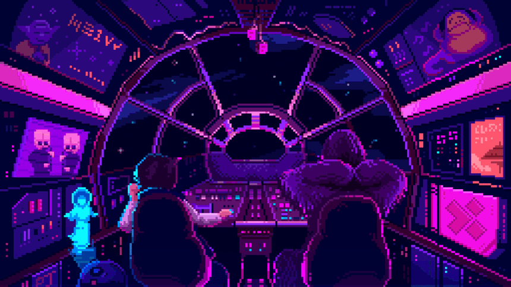

  

<h1 align="center">Zeyad&nbsp;Salem</h1>

  

  
  &nbsp;
  
  &nbsp;
  
  &nbsp;
  

---

### About

AI/LLM application engineer working on the layer between language models and real data — retrieval-augmented generation, text-to-SQL agents, and the interfaces that make them usable. I care about pipelines that survive contact with production, not just demos.

### Building

**AraBIRD** — Arabic text-to-SQL, working toward modern agent pipelines.

### Working with

Retrieval architectures, agent orchestration, and React/TypeScript front ends for LLM-backed tools.

 

### Stack

  

Also working with: `LangChain` &nbsp; `LlamaIndex` &nbsp; `RAG` &nbsp; `Text-to-SQL` &nbsp; `pgvector` &nbsp; `Qdrant` &nbsp; `Hugging Face` &nbsp; `Ollama` &nbsp; `OpenAI API` &nbsp; `Pandas`

---

---

<picture>
  <source media="(prefers-color-scheme: dark)" srcset="https://raw.githubusercontent.com/Zeyadmosalem/Zeyadmosalem/output/github-contribution-grid-snake-dark.svg" />
  <source media="(prefers-color-scheme: light)" srcset="https://raw.githubusercontent.com/Zeyadmosalem/Zeyadmosalem/output/github-contribution-grid-snake.svg" />
  
</picture>

  

  

